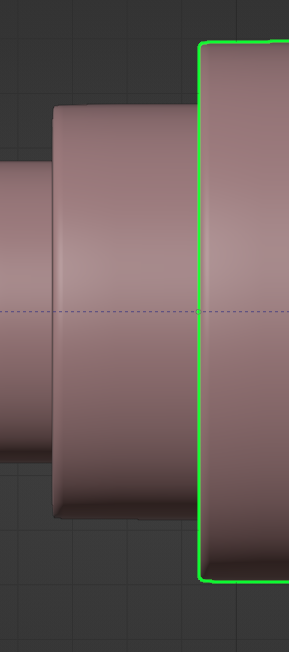
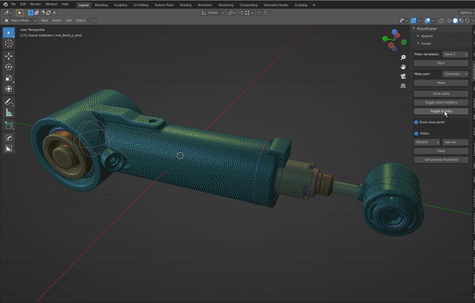

# Adding an armature

After you prepared the piston you're almost done. This section describes how the add armature operator works.

**Object names**  
Object names should be a single word, you can use special characters but not spaces to separate words. Some objects require a specific name, in template mode this is done for you, in custom mode you can refer to the on-screen warnings.  

**Type of piston**  
The operator knows a few different approaches, you toggle between these by changing the value of the 'Front length anchor' checkbox. The right approach depends a lot on where the mounts are placed and wether they should pivot or not. See the length anchor section for more.

**Telescopic rods**  
Telescopic rods can also be made at this point. Simply duplicate the first piston rod and scale it down on the X and Z axis. Move it slightly forward. Each rod needs its origin set to its end. 

**The armature**  
Most importantly, objects are expected to be in a certain collection, this is how the operator knows what it should do with objects. To a lesser extent, object locations matter too. They should never have their origin at world origin.

>If you changed the (custom)center of a piston this affects objects too, this is visible in the overlay where you change the center location. 

There is one exception: Objects that are so long that they have vertices on both sides of the y axis. These can have their origin at world origin(or the custom center value) with no consequence. You must select these objects as these are the ones that stretch.

Only objects that are linked to any of the following child collections will be affected: 
>Cylinder, Rod, Mounts, Connectors(If present)

**Any other child collections will be appended as well, so long they are childs of the 'PIS-Piston(O)' collection. You can use this to add joints and have some freedom while managing decals or other decorative objects.**

**Additional information**
Static connectors can be added before you add an armature. Non-static, meaning the connectors have control empties, connectors should be added after you added the armature. With connectors I mean hose connectors. The connectors collection/category can also deal with objects that fit in no other collection/category. It is optional. As an mnemonic, if your object(or assembly even) relies on (complex) relationships, exclude it from the process and add it back afterwards. Either drag it out of the PIS-piston(o) collection or rename the collection.

