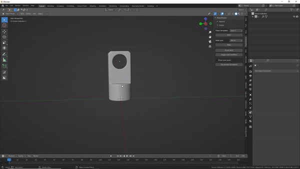
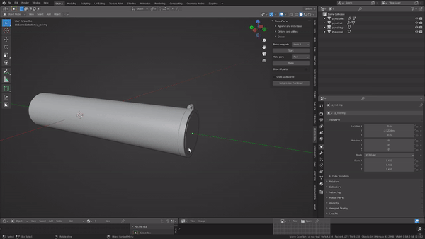

# Adding your own parts and templates

Yes you can!

**Parts**  
Adding parts is quite easy and best demonstrated with gifs:

Mounts(and connectors):  

> Child objects are supported. The biggest/main object however, should be the active object. Take note of the origin of the main object. Even if the mount pivots at a different location, this origin should be at the world origin(x, y axes). Origins do not matter much for connectors.

Rods:  

>If the rod comes with multiple child objects, you only select 1 child object and lastly the rod. **For rods the scene should be empty and only contain to-be rod objects to make this work properly!**

>Also: A rod needs its origin set to a number < 0 on the global Y axis. Any vertices 'beyond' the origin will stick out of the piston. These rods are not suited for the custom mode typically. Rotation should also be applied after rotating the cylinder.

If you make a part with these features, the proper collection structure and/or any name conventions are added for you.

**Templates**  
At the bottom of the documentation page on blendermarket there is a reference sheet describing what's required/possible. I tried to keep it as simple as possible! Most of what you see in a template is completely optional. I use drivers that derive input from an empty its location for some templates.
