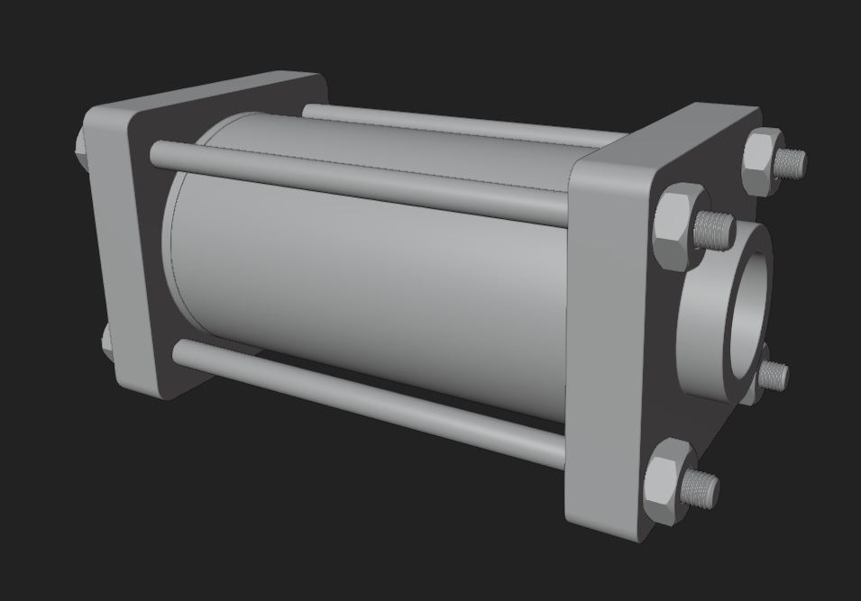
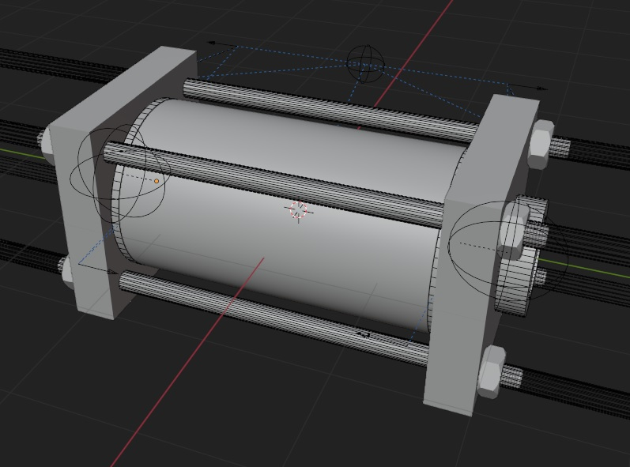

# Create

Pistonpusher offers a way to model pistons easier. Multiple workflows are supported. There are parts that you can place, think of mounts, connectors and rods. You can also add your own parts!

To get started, just open the pistonpusher pop up menu and hover over 'Create' dropdown menu. You can start the creation mode but also make parts with the options available in it.

**Creating a piston - Template mode**  
This mode was designed for boolean heavy workflows and tie rod designs especially. It's fairly constrained but you can still edit meshes manually to heart's content. Some templates come with a high amount of empties. These offer a way to adjust the primary shape of the piston.

>Normally, the bevels are turned off for performance reasons after you added more booleans.

>The empties can be used to change the tie rods, cap and rod end sections.
  

**Creating a piston - Custom mode**  
This mode was designed for subd workflows but can essentially handle everything you throw at it. You have access to all the parts in this mode too but you start without a template. How you get the objects does not matter, they just have to be in the right collection. Mounts require special care and they must be handled but there are tools for this. 

