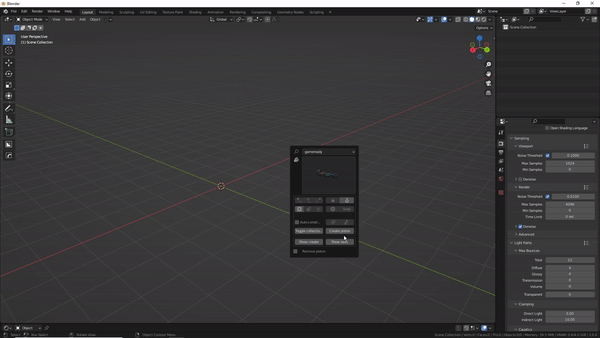

# Create a/To piston

<iframe width="560" height="315" src="https://www.youtube.com/embed/WnEdz10-OmM" title="YouTube video player" frameborder="0" allow="accelerometer; autoplay; clipboard-write; encrypted-media; gyroscope; picture-in-picture" allowfullscreen></iframe>

>This tool creates a piston like object out of objects. If you use it on a cylinder, it will assume the length and radius of that cylinder. It can also spawn one at world origin.

>In- and extrusions can be added and even randomized(raise random seed value above 0). The influence values are essentially multipliers that increase the effect.  

  
**Create a/To piston v2**

> Since pistonpusher version 2.9, there is support for mounts. Combined with presets, you can now save your favourite creations or quickly get a simple piston set up for the custom creation mode(Enable 'For create?').  
  
> Note: Mounts and additionally bevels have the potential to make the tool slow, it all depends on the mount and settings. Also, first revert to operator defaults if trying to use a preset when the tool was already used(The mount off-set values do not correctly apply if you don't).
