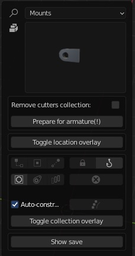
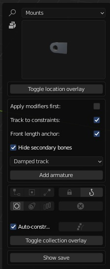

# Template mode

Where these features appear depend on your add-on preferences!

**1** 
>Hold shift and press 'start'.

**2** 
>Add objects and model your piston. Get rid of the red warnings. Some designs might not need a length anchor, ignore the length anchor warning in this case.

**3**

>Press prepare piston. You can still work on the piston after you prepared it but it should have the basic objects that make up a piston at this point.(Cylinder, rod and mounts).

**4** 
>Decide whether or not to apply remaining modifiers yourself. The other two(three) checkboxes are used to decide which kind of piston/cylinder you're about to constrain. Disable track-to constraints for fixed mount pistons that do not need to pivot. Disable front length anchor for rod end mounted pistons. Note that you'll still end up with an empty called 'length anchor' and one called _rla but that it serves a different purpose from the 'normal 'length anchor. This one will be at the back of the piston. Used to change its length. It does not need the same drivers. You'll need to both set the proper length anchor location and still specify whether its at the front or back(forward length anchor true/false). **Always apply scale and rotation after you prepared a piston!**

**5** 

>At this point you should select certain* objects and hit the 'add armature' button. There is also the ability to specify which type of track to constraints you want. The save panel will appear and all you have to do is select a directory and specify a name(optionally). It will also save a thumbnail(based on your viewport, no camera needed).