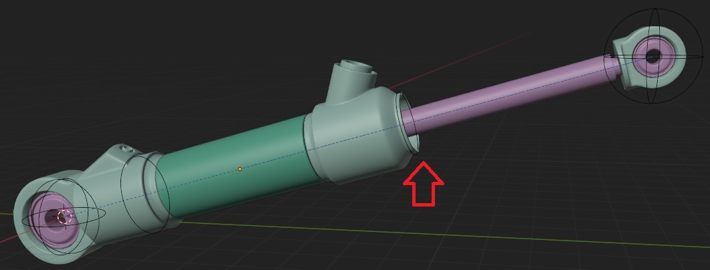

# The length anchor

The length anchor is essentially just an empty to which piston parts are attached. The length anchor is driven by a driver that ensures a relative position is maintained as you stretch the piston.
Long parts are hooked to the length anchor. The cylinder of a piston is almost always hooked to it. The idea is that you keep things flexible for as long as possible. Only make the piston rigid if you need to.

This means that the stroke can made longer and shorter as you see fit.

The length anchor also plays an important role in how the add armature operator works. Length anchors can be at the front or back of a piston. This is entirely decided by where the 'cap end' or 'A' (side) mount or pivot point is located.

>The most common types usually have a forward length anchor. The default settings usually suffice.

>A piston with a rear length anchor. It essentially performs the same role but on the other side. Note how the 'cap end' or A side mount is at the front of the piston. If we'd add a length anchor to the front here, it would not work as intended.

**Custom property**  
length anchors have a custom property, visible in the n-panel item view. It's value represents a soft-max limit. If the piston is stretched beyond this length, the length anchor will maintain a position roughly half-way the total piston length. You can lower and increase it as you see fit. If you want to place pistons in an extended state, lower it.

