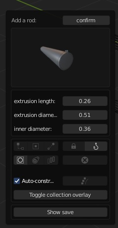
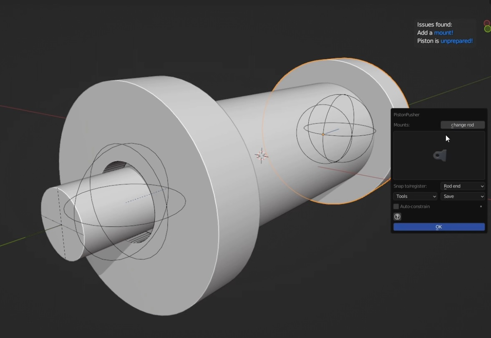
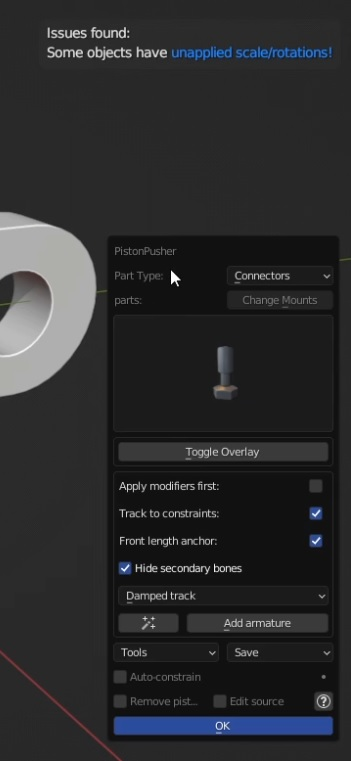
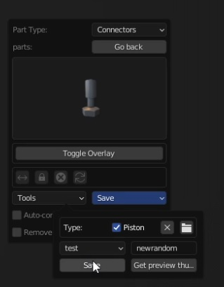

# Template mode

Where these features appear depend on your add-on preferences!

**1** 
>Select a template from the drop down list and press 'start'.

**2** 

>You're able to select a rod. Because there are many objects in a relatively small location, I exposed some of the options regarding the booleans used, in this panel. If you want to switch a rod, just select another thumbnail. Some templates offer more options than others.

**3** 

>After clicking on 'confirm', you can add mounts. The X button removes that mount. Note that you can snap to 'None'. But you should consider it as advanced usage. Don't snap a mount to 'None' if you wish to use it as a pivot point. In fact, any mount added this way should be removed from the mounts collection before trying to constrain it. As it will lack the proper name convention for this and will only mess with the constrain process. This means that side mounts ( and trunnion mounts) must be snapped to a side as well(and then be placed into the proper position manually). The best course of action if you need/wish to use none is to use it after two mounts have been snapped already.

**4**
 
>After clicking next, you can prepare the piston. This unhooks everything and grabs the objects as they are. Maintaining visual transform while getting rid of hooks, constraints and parent-child relationships. Click this once you're absolutely sure that you're satisfied with the current dimensions/proportions. If you're done using booleans and already applied them, you can opt-in to remove the cutters collection. **Note that if you build a piston with a template, if you wish to save the file, save it before pressing the prepare button.** You can still work on the piston after you prepared it but it should have the basic objects that make up a piston at this point.(Cylinder, rod and mounts).

**5** 

>Decide whether or not to apply remaining modifiers yourself. The other two(three) checkboxes are used to decide which kind of piston/cylinder you're about to constrain. Disable track-to constraints for fixed mount pistons that do not need to pivot. Disable front length anchor for rod end mounted pistons. Note that you'll still end up with an empty called 'length anchor' and one called _rla but that it serves a different purpose from the 'normal 'length anchor. This one will be at the back of the piston. Used to change its length. It does not need the same drivers. In the custom template mode you'll need to both set the proper length anchor location and still specify whether its at the front or back. **Always apply scale and rotation after you prepared a piston!**

**6** 

>At this point you should select certain* objects and hit the 'add armature' button. There is also the ability to specify which type of track to constraints you want. The save panel will appear and all you have to do is select a directory and specify a name(optionally). It will also save a thumbnail(based on your viewport, no camera needed)

**Additional information**
You may notice some piston rods come with mounts or decorative pieces like thread. These rods serve a secondary purpose and are intended for side mounted pistons.