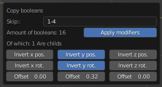

#Copy booleans
  
  
  
This tool can copy booleans from **one** object to the active object.  
  
All copied cutters are parented to a control empty named: 'booleans_ctrl'. It can also apply cutter modifiers(except if they are booleans) but this is fairly expensive/slow, I recommend using the control empty if it gets slow.    
  
If you wish to skip a boolean, you just enter the index of that boolean in the skip input field, ranges are supported. examples:  
  
> 0, 1 - will skip boolean 0 and 1  
> 0-5, 8-10 - will skip booleans 0-5 and 8-10  
> 0, 2-5, 7, 11-15 - will skip booleans 0, 2-5, 7 and 11-15  
  
or using the end 'keyword':  
  
> 5-end   - Will skip booleans 5 to end of stack  
> end(-3)-end   - Will skip the last 3 booleans  
> 5-end(-3)   - Will work too.  
  
They can be combined as well: 0-3, 6, end(-5)-end(-3), allowing you to make exactly the selection you need, even if there are many booleans. The upper most boolean in the modifier stack represents boolean 0 and so on. I realize this might sound slightly confusing but its really just like choosing which pages of a document you want to print. This seemed the least 'space' consuming method to offer such a feature. It was brought to life so that users can symmetrize piston 'caps' while not disturbing the template's workings, in a more intuitive way. And perhaps most importantly: Regardless of dimensions and orientation of either the source or target object.    
  
The target object itself is never changed but you can use the offset values and skip booleans to deal with caps of different dimensions when a certain degree of symmetry is desired. If cutters use mirror modifiers and you wish to invert rotations, enable 'apply modifiers'.  
  
  
**limitations:**  
 * Supports 1 layer of child booleans.(cutters on cutters). Note that child booleans are prepended in terms of indexes. so if there is only 1 child boolean, its index will be 0.   
 * Mirrored cutters should have their origins somewhat center to their parent object, otherwise, inverting rotations will not have the desired result.  
 * Hard ops slice booleans, the difference cutter will be copied but the cutout object not.  
 * end() and end only works while used in a range.  
 * Source and target object should not be parented or constrained with a child of constraint.  

