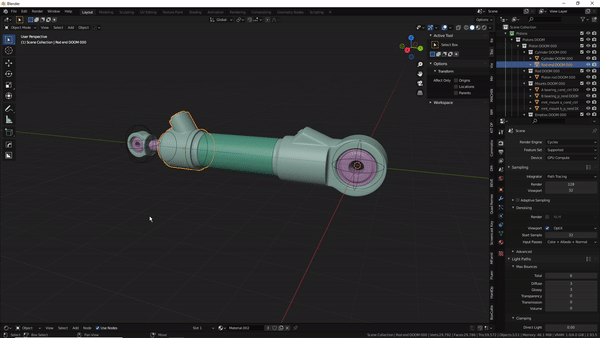

#Delete piston

  
>This tool works on any part of a piston. Other pistons of its type are renamed automatically if need be.  
  
>To remove a piston or part from file, there is an option at the bottom of the pop up menu, if enabled, any selection made, part or piston, will be removed from file(indexes are updated afterwards).

