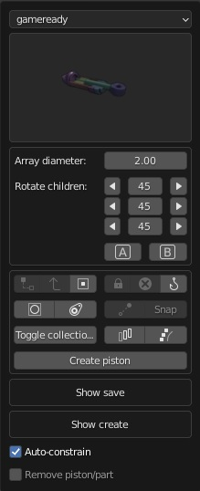

#Linked duplicate radial array

  
>Make radial arrays based on linked duplicates out of any kind of object, including empties. Size can be adjusted if the main empty is selected, in the pop up menu. If a group of pistons is constrained to such an array, you can select all the ends with the A/B buttons.
  
  
>As of version 3.1.0, objects that are constrained to array elements(child of), can be rotated using the pop up menu instead of using the A B selectors and then manually rotating them. 

    
