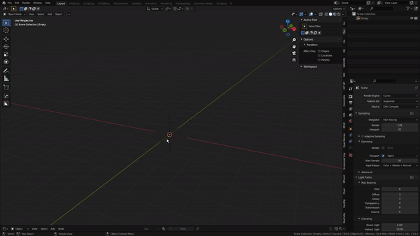

#Multi-place

  
>Easily place multiple instances at the locations of the selected objects. It will place the instances of the type that was added last. Ie, what the thumbnail shows, wether it is actually present or not.

>It can detect the main empty of pistonpusher radial arrays!