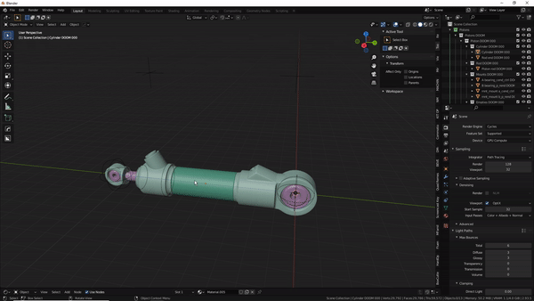

#Select tool
  
>Default shortcut is **CTRL+SHIFT+DOUBLE LMB**

>Select all parts belonging to a piston, visible or not.

>It can also select the 'next' empty. If you use this tool on an empty named empty.001, it'll also select an empty named empty.002