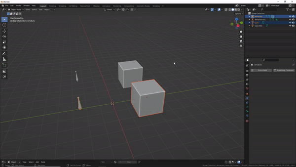
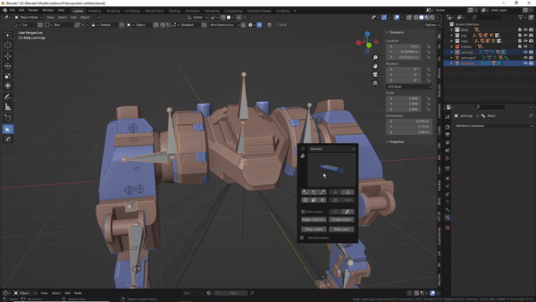
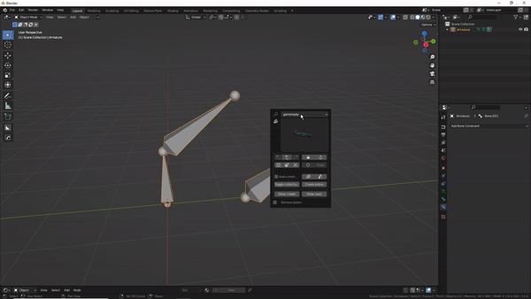
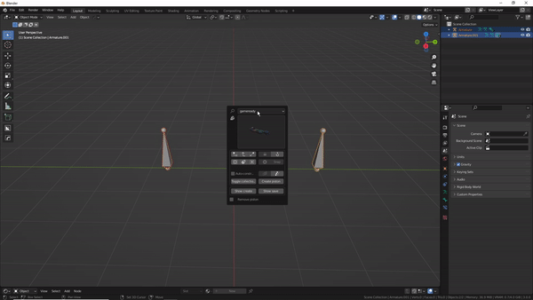

#Set bone as parent tool

This is a 3 mode tool designed to rig quicker. 

**object to armature** mode allows you to set a bone as parent for any number number of objects. Excluding other armatures however. Relative/non relative is supported( ie, transforms can be maintained)

**armature to armature** mode can be used to tie 2 different armatures together. This mode adds a pose bone child of constraint targeting a bone in another armature.

**inter-armature mode** can be used to add a child of constraint targeting another bone within the same armature. 

All modes are controlled the same, primarily by left and right mouse button clicks to (de)select bones and progress step wise through the process.

hotkeys:

>scroll mousewheel up/down - cycle bone layer visibility of the active armature.  
>Q - Restore original bone layers visibility state  
>W - Relative on/off(obj. to arm. only)  
>E - Switch 1st armature (arm. to arm. only)    
>ESC - Cancel  
>LMB - select/confirm  
>RMB - deselect/cancel  
>Middle mousebutton and numpad for camera control  

Other things to know:

* In the case of inter-armature and armature to armature operations, the first selected bone will receive the constraint, the second bone will be its target. You'll have to double right click to de-select a bone properly. 
* In the case of armature to armature operations, you can only use the E shortcut if no bones are selected, a message should appear, instructing you to deselect bones/go back.
* Bone layers visibility state is always restored to original upon exit/finish.

**object to armature**
  

**armature to armature**
  

**inter-armature**

**Bone layer visibility example**
  