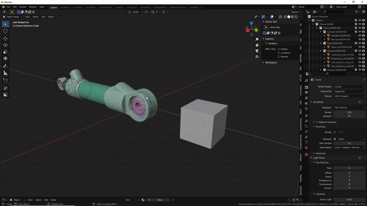

#Snap selected to active
  
>This is a re-make of blender's native snap selected to active. There are some differences:

>- Can properly snap objects that have a (single) child-of constraint.
>- Can snap single object to 3d cursor.
>- Can ignore/inherit location/rotation/scale in a similar manner as the snap features found in machin3tools.

>There is also an opt-in in the pistonpusher pop up menu(shift+e). It's called **Auto-constrain** It automatically adds a child of constraint after you snapped objects.