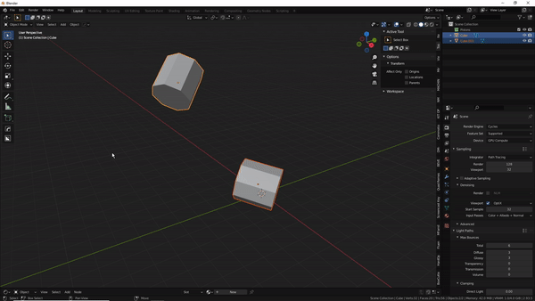
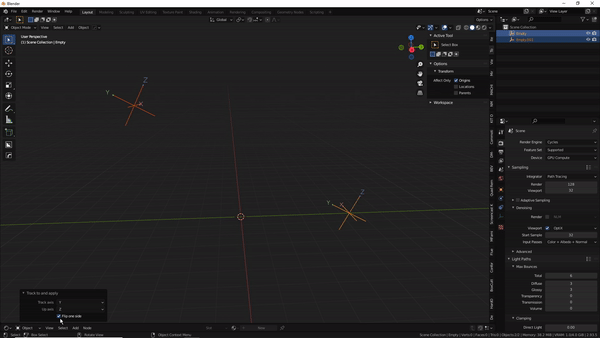

#Track to (and apply)
  
Similar to adding track to constraints and applying them, this tool can do it without using constraints.  
  
  

>This tool can be used to align two objects. You can specify a track and up axis in the re-do panel.  
  
>It can be used to align empties for the **snap modal** if you enable the 'flip one side' option, provided you align them along the 'Y' or '-Y' axis ofcourse:  
  
  
  
  
**As of pistonpusher version 3.4.3**  
  
WAT mode was added.  
  
To use WAT, you simply select a third object. This third object should be the active object for it to work properly.  
  
WAT, simply put, makes the track to operator useful in situations where the pre-defined UP axis is not desired. It's probably only useful to place pistons for pistonpusher because it can only rotate objects around their local y axis.  
  
It uses vector math to calculate the angle between two axes, one axis of the tracked objects and another of the active object. This works because the (local) X and Z axis of the tracked objects already have the correct orientation after they've been aimed at eachother.  
  
Multiple combinations of match 'axis' with ' axis' can work for a given situation. I recommend using the combination with the smallest difference.  

<video width="320" height="240" controls>
  <source src="../vids/watmode.mp4" type="video/mp4">
</video>