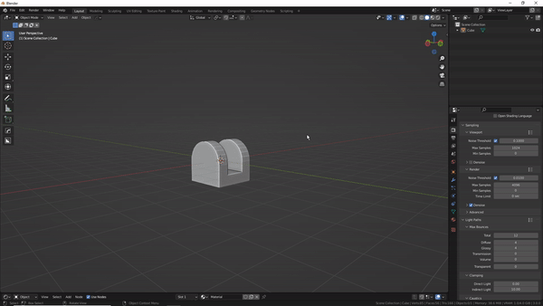

#Track to (and apply)
  
Similar to adding track to constraints and applying them, this tool can do it without using constraints.  
  
  

>This tool can be used to align two objects. You can specify a track and up axis in the re-do panel.  
  
>It can be used to align empties for the **snap modal** if you enable the 'flip one side' option, provided you align them along the 'Y' or '-Y' axis ofcourse:  
  
  
  
  
**As of pistonpusher version 3.3.0**  
It can now also inherit rotations from the objects it is called on.  
  
  

Note that this will only work once on a certain pair of empties. It works like this:  
  
The locations of the objects are used to create a vector, originally, you'd just get a vector with a pre-determined up axis. This option simply allows you to set a rotation before hand, which is added back once the objects are aligned along the calculated vector. This happens on a per object basis, so, each object can have a different rotation.

