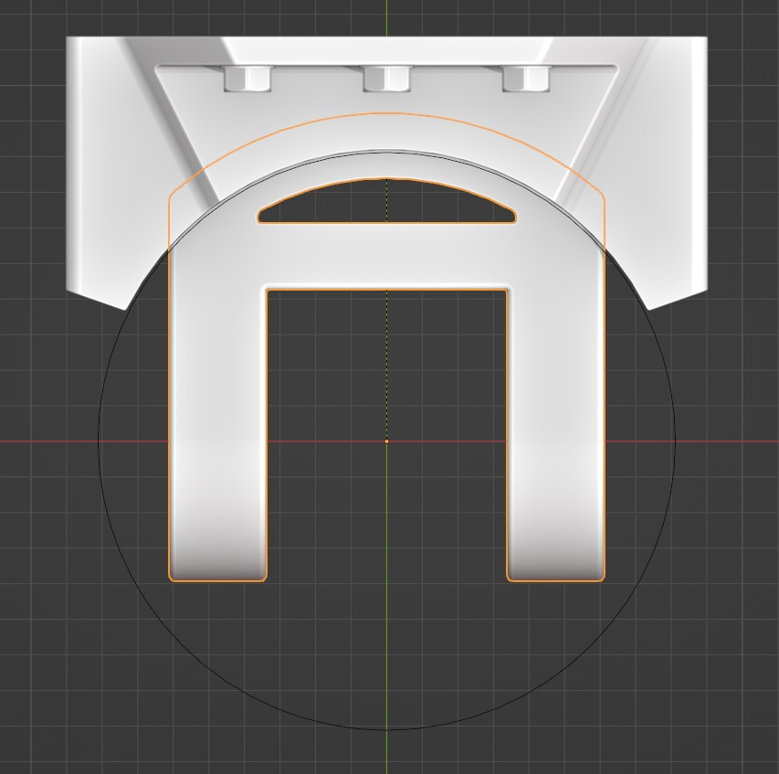
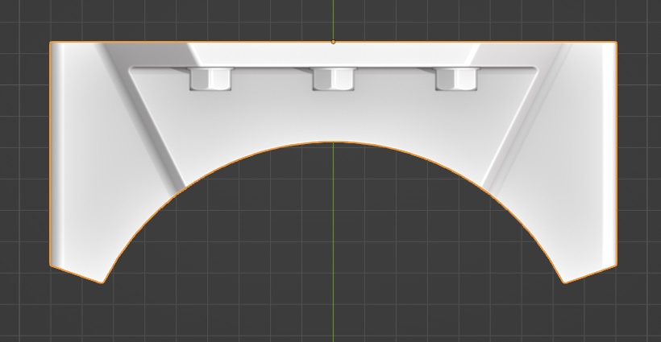

# Custom Joints  
  
Extend an existing piston armature with an extra mounts. This requires an 'assembly' of 2 parts(child objects are supported in a similar manner as the simple piston feature), with their origins in a logical position.  
  
These objects should also have a local orientation similar to that of the rigged piston, their final global rotations does not matter much. The easiest way to get the correct local alignment without much thought is to align an object with the piston armature and parent it. (Using the parent helper, not wizard!) You can then unparent, snap and modify it further as needed.  
  
 
  
  
The above image gives an idea of what the correct local orientation should look like but it can be confusing to interpret as global rotations may rotate objects so that they appear (in)correctly aligned when in reality they may not be. Additionally, this tool expects a piston with horizontal mounts. I hope to eliminate this limitation in the future but I considered this less important because the resulting piston armature can be rotated if needed. You can also rotate the objects 90 degrees before rigging them. Just make sure this rotation is not applied!  
   
  
Lastly, the mount should be a child of the other object. With its origin at its pivot point. The root object origin should be at the 'wall' side or whichever surface 'connects' with another object/part of your model.  
  
  
  

To use this feature: 
  
Select the mount object and a (rigged!) piston object then call the quick rig menu and select the 'add custom joint' option.  
  
A circle indicates the allowed rotation axis and is only affected by the lock axis. The following values can be used as a reference:  
  
track Y, lock Z/X  
track Z, lock Y  
  
An error can occur for a variety of reasons, if this happens, an message saying please check console will appear with more information.  

  

