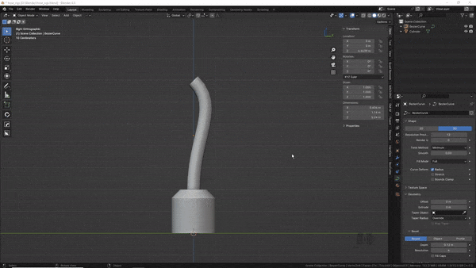

#Expose root  
  
Expose the 'ends' of an armature as empties, so that they can be controlled in object mode.  

This requires 2 bones without a parent and that the origin of the armature matches with the head of the root bone.  
  
  

