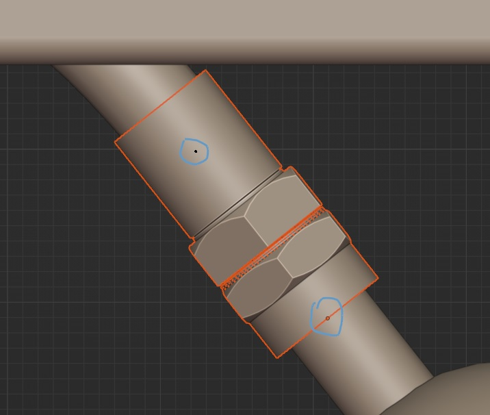
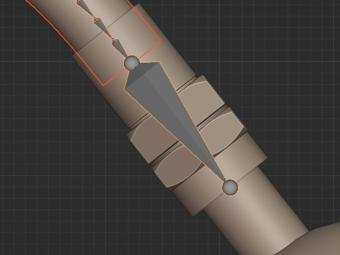

# Cable/Hose rigs 

This operator can rig a selection of 1-3 objects. The active object should always be a curve, if not, the operator won't be visible. Transforms do not need to be applied(other than scale). Can set up itasc solver 3 point control rigs as well.  

To create an IK chain that can be used right away, additional objects have to be selected as well. The origins of these objects, in combination with the curve, are used to create the control bones:  
  
  
  
  
  
<iframe width="560" height="315" src="https://www.youtube.com/embed/DWFi8Pycqtc?si=ze0sk-D8rb7qX6MP" title="YouTube video player" frameborder="0" allow="accelerometer; autoplay; clipboard-write; encrypted-media; gyroscope; picture-in-picture; web-share" referrerpolicy="strict-origin-when-cross-origin" allowfullscreen></iframe>  