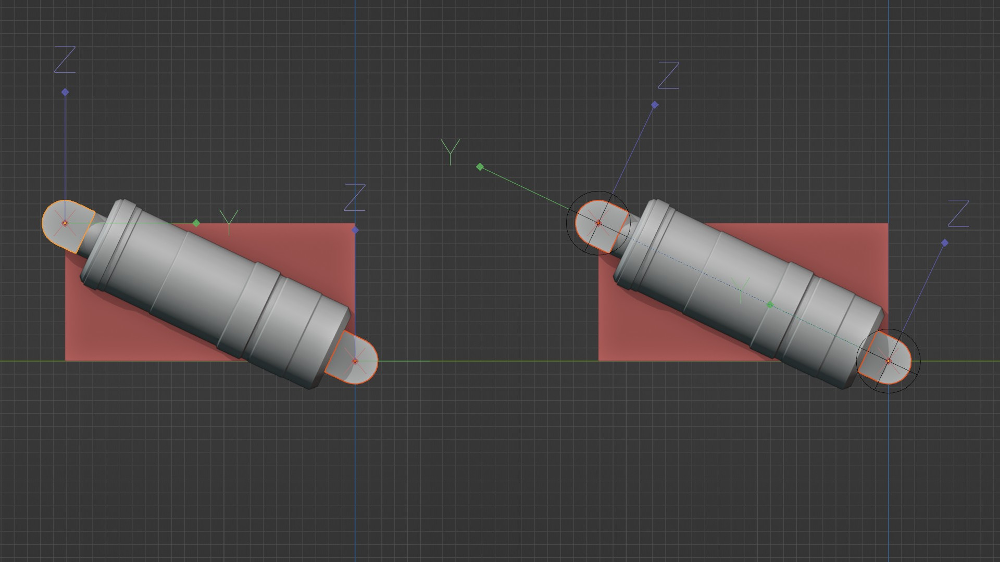
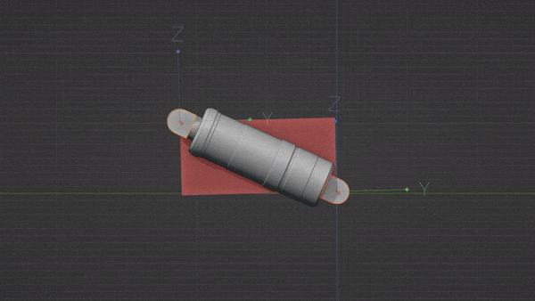

# Simple Piston

This tool can be used with a selection of two objects. These objects may have children which will be re-parented accordingly. Note that the rotations of the root level objects are used to define the plane your actuator will operate in.  
  
By default, the tool will re-align the local orientations of all actuator objects. To do so properly, in some cases, most notably vertical set ups(z axis), the 'use axis' *axis*(not the toggle!) may have to be changed.  
  
  

Above an example of the very common 2d actuator set up. Note that this tool can rig these regardless of rotation in world space(shown below).  
  
 
  
This holds until you move 1 mount on the X axis relative to the other, such that it would 'break free' from the red plane. At this point, your actuator will require more mounts. The new orientation for your actuator can be established using the piston planner once you have a mounting solution.  
  
There's also a button with a *refresh icon*, this may be used for advanced set ups where one mount is rolled relative to the other.  

