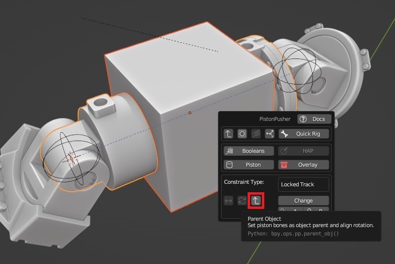

#Telescopic Pistons 
  
PistonPusher offers a system for actuators with telescopic segments/rods. This system works in a sequential manner, where you add/remove each rod separately.  
  
This system assumes that the B side of your piston (or its Rod End), also has a rod. This page calls this particular rod the 'original rod', or, when tracing back to A from the B side, the first rod.  
  
Note: The FIFO setting considers rods in a reversed order, starting from the A side. Staying analogous to its abbreviation (First In, First Out).  
  
  
##Requirements  
  
 - The origin of the rod you wish to add should be set to whichever end is closest to the B empty  
 - The local orientation of the rod should match that of the piston*  
 - This tool expects a piston in its rest state  
  
* PistonPusher offers a 'parent helper' to help with this, found in the main menu IF you have an object selected and a piston object as the active object. This will parent the object to the parent bone of the active object and align its rotation so that it matches your piston armature.  
  
  
Note: Any rods that you wish to add, should not be children of the piston already, un-parent them if needed!(With exception of the original rod, this will be a part of the piston already and should be left untouched)  
  
  
##How to use  
  
This section assumes you already have a rigged piston and prepared some rods. (All requirements are met)  
  
Select a rod, starting with the one closest to the B empty (but not the original rod!), then any piston object > Open menu > Quick rig > Add rod  
  
This is also how you remove them, but in this case, you start at the A side (Removing the last added rod first).  
  
Note 1: The operator tries to find your original rod, if for some reason it fails to recognize it, the object input field may be set to the original rod (An error icon will be visible if this has to be done).  
  
Note 2: I recommend/prefer using simple objects during set-up. Afterwards you're free to detail them and add more objects to each segment (if desired).  
  
Note 3: FIFO mode will lock a Piston to the given mode when the first (second if we include the original rod) rod was added.  
  
Note 4: The operator expects that the piston is in a retracted state during set up!  
  
  
##Leading/Trailing distance  
  
These settings work differently based on FIFO mode:  
  
FIFO ENABLED:  
  
Leading: Override FIFO order for this specific rod (Can be useful to set up malfunctioning systems)  
Trailing: Similar to leading distance when FIFO is DISABLED but considers the rods in a reverse order  
  
FIFO DISABLED:
  
Leading: Offsets the leading distance used by the limit distance constraint of the leading rod (Rod N-1)  
  
  
<iframe width="560" height="315" src="https://www.youtube.com/embed/advHm9VjPXM?si=mEARtn3Lp8x1ItPf" title="YouTube video player" frameborder="0" allow="accelerometer; autoplay; clipboard-write; encrypted-media; gyroscope; picture-in-picture; web-share" referrerpolicy="strict-origin-when-cross-origin" allowfullscreen></iframe>  